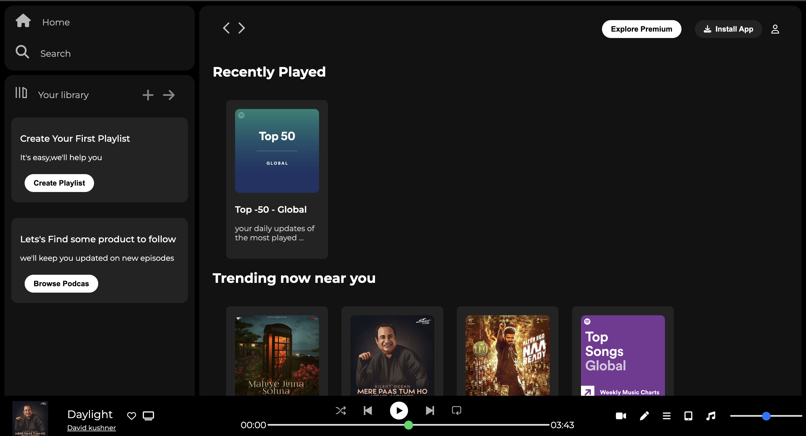
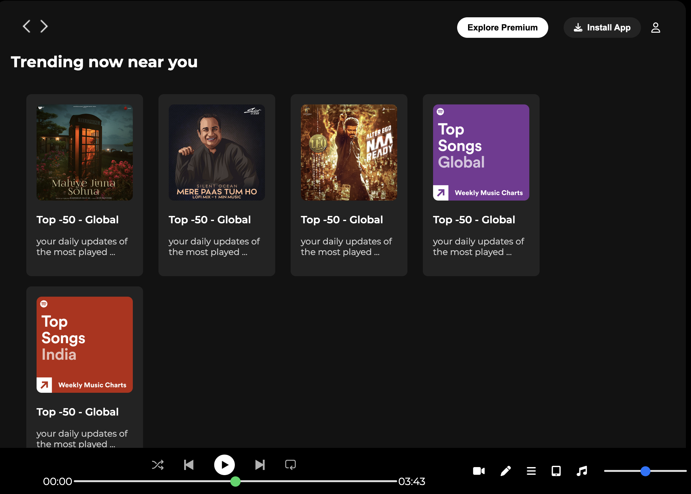

# 🎵 Spotify Clone (HTML & CSS)

A clean and simple clone of Spotify's user interface built using only HTML and CSS. This project is designed to replicate the front-end look and feel of Spotify's web app, perfect for practicing layout, design, and responsive styling without using any JavaScript.

---

## 🌟 Features

- 🎧 Fully responsive layout
- 🎨 Styled with CSS Flexbox and Grid
- 📱 Mobile-friendly design
- 🧼 Clean and modern UI structure
- ⚡ Fast loading, no frameworks

---

## 🚀 Getting Started

To view the project locally:

1. Clone the repository:
   ```bash
   git clone https://github.com/your-username/spotify-clone.git


## 📸 Screenshots

### Home Page UI



### Footer UI




📚 Learning Purpose
This project was created to practice front-end design skills and UI replication. Great for beginners wanting to improve their HTML/CSS layout skills.

📬 Contact
For questions or feedback, feel free to reach out at:
[Your Name] — [kg369033@gmail.com]


GitHub: Kundang25